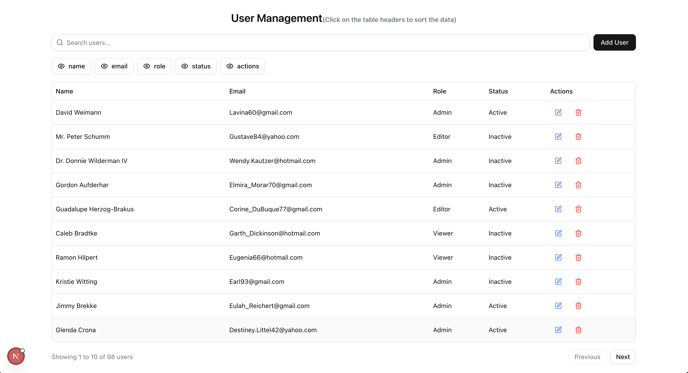

# Gaana AI Table

A modern, responsive, and fully-featured user management table built with **Next.js 15**, **React 19**, **Tailwind CSS 4**, and **TanStack Table v8**. This project includes full **CRUD operations**, **server-side pagination**, **sorting**, **column visibility toggling**, **search with debounce**, and user-friendly **modals for create/edit/delete**.

---


## 📊 Data Table
 - ✅ Fetch and display data from the JSON Server.

 - ✅ Server-side sorting, filtering, and pagination using TanStack Table v8.

 - ✅ Search with debounce that triggers server-side queries.

 - ✅ Column visibility toggling to show/hide columns dynamically.

## ✏️ CRUD Operations
 - ✅ Fully implemented Create, Read, Update, Delete flows.

 - ✅ Intuitive modal-based UI for creating and editing users.

 - ✅ Deletion confirmation modal for safe removals.

 - ✅ User-friendly toast notifications via Sonner.

 - ✅ Reusable API Service (lib/api.ts) to handle all network calls.

 - ✅ Graceful error handling for all API interactions.

---

## 📦 Dependencies

- `@tanstack/react-table` — powerful headless table logic
- `axios` — for API communication
- `lucide-react` — beautiful icons
- `tailwindcss` — utility-first styling
- `sonner` — toast notifications
- `@faker-js/faker` — data mocking
- `json-server` — quick local REST API

---

## 🛠️ Getting Started

### 1. Clone the repo

```bash
git clone https://github.com/premshetty/gaana-ai-table.git
cd gaana-ai-table
```

### 2. Install Dependencies:

```bash
npm install
# or
yarn install
```

### 3. Run JSON Server (mock API):

```bash
npx json-server --watch db.json --port 3001

```
### 4. Start the Next.js app:

```bash
npm run dev
# or
yarn dev
```
## 📜 Available Scripts

In the project directory, you can run:


| Script | Description |
| ------- | ----------- |
| npm run dev | Start development server |
| npm run build | Build the app for production |
| npm start | Start production server |
| npm run lint | Run ESLint to check code quality |
| npx json-server --watch db.json --port 3001 | Start JSON server for mock API |
    


